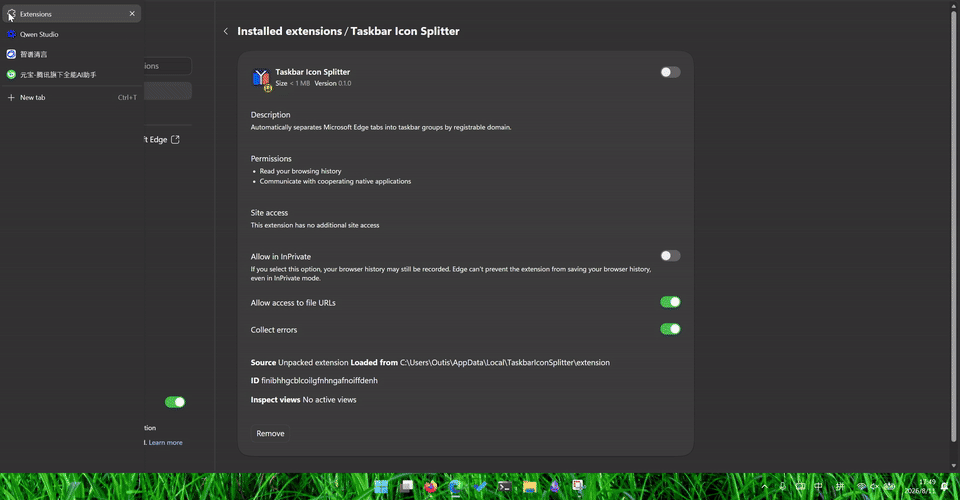

# Taskbar Icon Splitter

<p align="center">
  
</p>

<p align="center"><strong>让 Edge 的任务栏按网站分开，不再把所有页面挤在同一个图标里。</strong></p>

Taskbar Icon Splitter 会把不同网站的标签页整理到各自的 Edge 窗口，并为这些窗口显示对应的网站图标。你可以直接从 Windows 任务栏找到 GitHub、Gmail 或其他正在使用的网站，不必先点开 Edge 再翻标签页。

<p align="center">
  
</p>

## 它会怎样整理标签页

- `www.github.com` 和 `gist.github.com` 会放进同一个 GitHub 窗口。
- `github.com` 和 `mail.google.com` 会显示为两个任务栏按钮。
- 端口不同不会被拆开，例如两个 `localhost` 开发服务仍属于同一组。
- 置顶标签、InPrivate 窗口、Edge 内部页面和非 HTTP(S) 页面不会被移动。
- 新建标签或跳转到另一个网站后，扩展会自动把标签移到正确的窗口。

## 安装前请注意

- 当前支持 Windows 11 x64 和 Microsoft Edge Stable。
- 扩展还需要一个 Windows Companion 才能修改任务栏图标。首次使用页会提供一键安装程序。
- Companion 已包含所需运行时，普通用户不需要编译源码，也不需要安装 Node.js、.NET 或任何 SDK。
- 扩展首次加载后默认暂停。只有点击“启用并整理”后，才会移动已经打开的普通网页标签。
- 暂停扩展会恢复默认的 Edge 图标，但不会把已经拆开的窗口重新合并。
- 按网站生成的任务栏按钮不能固定到任务栏。

## 安装

### 从 Edge 加载项商店安装

1. 在 Microsoft Edge 加载项商店点击“获取”。
2. 首次使用页会检测 Companion；如果尚未安装，点击“下载 Companion 安装程序”。
3. 运行下载的 `TaskbarIconSplitter-Setup-x64.exe`。它按当前用户安装，不需要管理员权限。
4. 回到首次使用页点击“重新检查”。看到“Native Host 已连接”后，再点击“启用并整理”。

扩展不会在你确认前移动现有标签页。以后扩展由 Edge 更新；Companion 更新时，重新运行最新版安装程序即可。

### 从源码安装（仅供开发和测试）

源码构建需要 PowerShell 7、Node.js 20+、npm 和 .NET 8 SDK。在仓库根目录运行：

```powershell
.\scripts\install.ps1
```

首次运行会下载依赖、完成构建和测试，再把程序安装到当前用户的：

```text
%LOCALAPPDATA%\TaskbarIconSplitter
```

完成后请保留终端中显示的 `Unpacked extension path`，然后：

1. 在 Edge 地址栏打开 `edge://extensions`。
2. 开启“开发人员模式”。
3. 点击“加载解压缩的扩展”。
4. 选择安装脚本刚刚显示的目录，通常是：

   ```text
   C:\Users\<你的用户名>\AppData\Local\TaskbarIconSplitter\extension
   ```

首次加载会打开使用说明页。看到“Native Host 已连接”后，点击“启用并整理”。

## 日常使用

- **自动按域名拆分**：关闭后停止自动移动标签，并恢复窗口的默认 Edge 图标；重新打开会再次整理。
- **立即整理**：扫描当前所有普通 Edge 窗口，把遗漏的标签放回正确位置。
- **已管理的域名窗口**：显示当前由扩展接管了多少个网站窗口。
- **五阶段耗时**：仅用于排查性能问题，正常使用时无需关注。

如果你正在填写表单、进行视频会议，或暂时不希望窗口发生变化，可以先关闭“自动按域名拆分”。

## 隐私与本地数据

扩展需要读取标签页地址和窗口状态，才能判断标签应该放到哪里。项目不包含账号、云同步或遥测上报。

为了显示网站图标，程序可能会请求网站的 favicon。图标缓存、诊断日志和 Native Host 都保存在 `%LOCALAPPDATA%\TaskbarIconSplitter`；开关状态和耗时统计保存在 Edge 的本地扩展存储中。

完整的数据范围、保存位置和删除方式见 [隐私政策](PRIVACY.md)。

## 常见问题

### 显示“Native Host 未连接”

从商店安装的用户请在首次使用页重新下载并运行最新版 Companion，然后点击“重新检查”。

从源码安装的用户可以在仓库根目录重新运行：

```powershell
.\scripts\install.ps1 -SkipBuild
```

如果仍然失败，请完全退出再重新打开 Edge。

### 源码安装时提示找不到 .NET 8 SDK

先检查当前终端：

```powershell
dotnet --list-sdks
```

输出中需要包含 `8.x`。如果已经安装但这里看不到，请改用能识别 .NET 8 的 PowerShell 7 或 Visual Studio Developer PowerShell。

### 标签已经拆开，但图标没有更新

先关闭再打开“自动按域名拆分”。如果图标仍未刷新，请完全退出 Edge，删除 `%LOCALAPPDATA%\TaskbarIconSplitter\icons`，重新打开 Edge 后点击“立即整理”。

### 仍然无法定位问题

- Native Host 日志：`%LOCALAPPDATA%\TaskbarIconSplitter\logs\native.log`
- 扩展错误：在 `edge://extensions` 中打开本扩展的 Service Worker 控制台

## 更新

Edge 会自动更新商店扩展。Companion 有新版本时，下载并重新运行最新版 `TaskbarIconSplitter-Setup-x64.exe`，原有设置和缓存会保留。

从源码安装的用户获取新代码后，再次运行：

```powershell
.\scripts\install.ps1
```

随后到 `edge://extensions` 点击“重新加载”。

## 卸载

1. 在扩展弹窗中关闭“自动按域名拆分”。
2. 在 Windows“设置 → 应用 → 已安装的应用”中卸载 Taskbar Icon Splitter Companion。
3. 在 `edge://extensions` 中移除 Taskbar Icon Splitter。

从源码安装的用户也可以在完全退出 Edge 后运行：

```powershell
.\scripts\uninstall.ps1
```

卸载 Companion 会删除 Native Messaging 注册、网站图标缓存和诊断日志，不会删除你的浏览数据。

## 开发

完整构建与测试：

```powershell
.\scripts\build.ps1
```

构建结果位于 `dist\extension` 和 `dist\native`。依赖已经还原时可以加 `-SkipRestore`；只想跳过测试时可以加 `-SkipTests`。

生成 Edge 商店 ZIP 和无需 SDK 的 Companion 安装程序：

```powershell
.\scripts\build-release.ps1 -StoreExtensionId <Edge 商店扩展 ID>
```

正式发布步骤、签名要求和上传顺序见 [RELEASING.md](RELEASING.md)。

主要目录：

- `extension/`：Edge 扩展
- `native/`：Windows Native Host 与测试
- `installer/`：Companion 安装器定义
- `scripts/`：构建、发布、安装和卸载脚本
